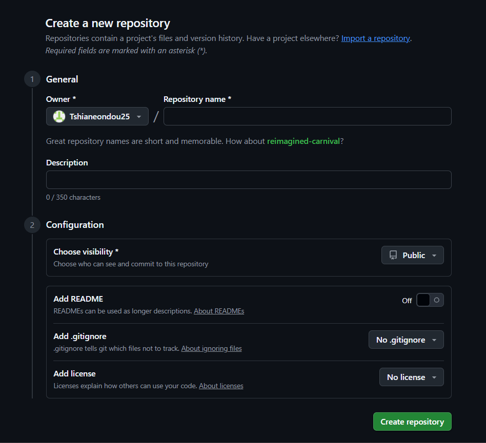
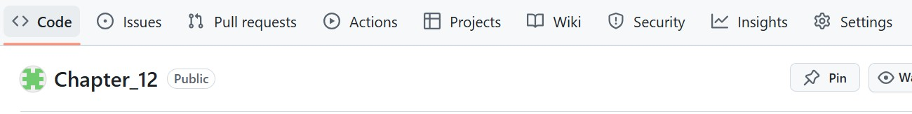
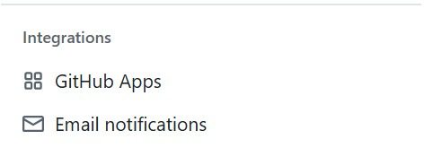
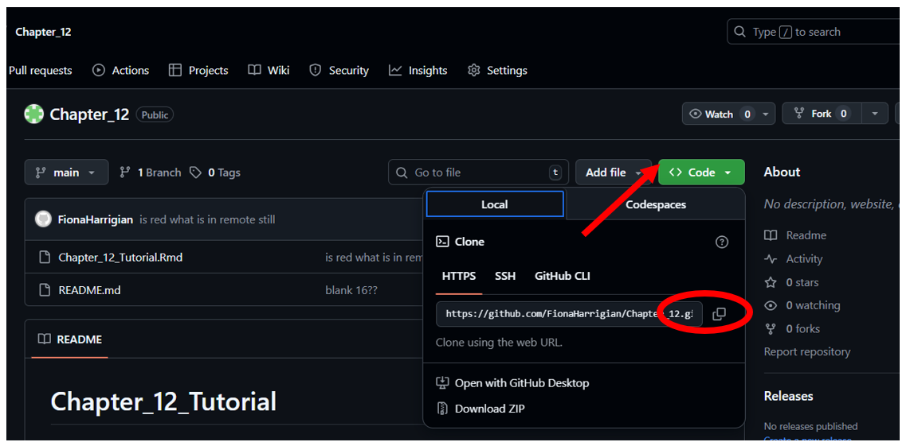
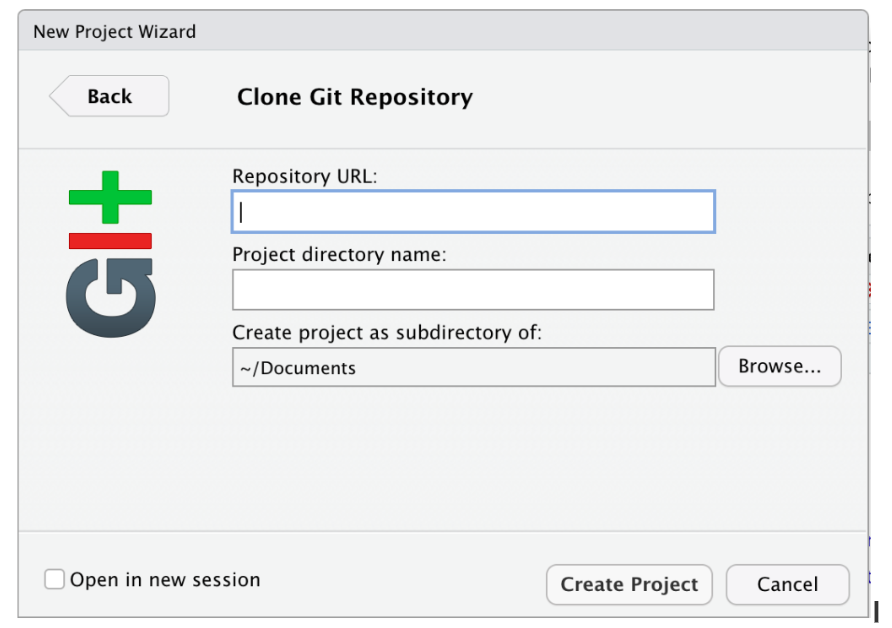
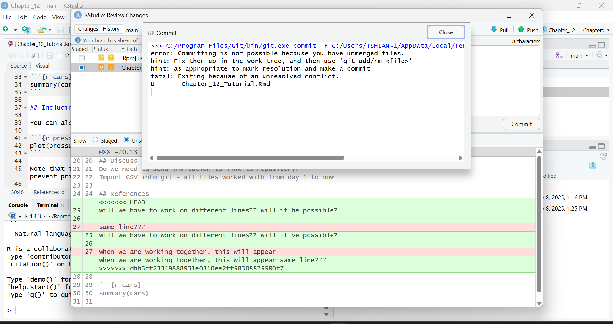

```{r packages, results='hide', message = FALSE, warning = FALSE}
#NEED TO MAKE SURE INCLUDES ALL PACKAGES

library(dplyr)  
library(kableExtra)
library(dplyr, tidyverse)

```

```{r setup, include=FALSE}
knitr::opts_chunk$set(echo = FALSE)
```


# Introduction
Throughout this semester, we have discussed making our science reproducible and accessible. We started by learning the concept of reproducible science and why it is so important. We also learned that there is a reproducibility crisis, what might be causing it, and how to address it. To address writing reproducible code, we learned about R markdown files and how to format them in a clear, reproducible way. We next learned how to make bibliographies, appendices, tables, figures, citations, and references in R markdown and how to use settings to best display them. We learned about creating and using functions and lists in R and writing code in a clear, reproducible, and defensive way. 

Then, we discussed the scientific method and how to mitigate the threats to each step of the scientific process. One of the mitigation strategies is using the TOP (Transparency and Openness Promotion) Guidelines, another is the OSF (Open Science Framework). Other mitigation strategies include the FAIR and CARE principles. FAIR principles focus on making data accessible to everyone, whereas CARE principles apply specifically to data involving Indigenous People and emphasize considerations of who benefits from the data, who can collect the data and the responsibilities and ethics surrounding the data. They are technically in opposition to each other but are equally important to consider when conducting research and before sharing data. Connected to this was the concept of a Creative Common license and which would be best to use for your own research. 

Finally, we learned about data management, that it is best to create a data management plan before starting research, and how to manage your data in a way that means it will continue to usable by you, your colleagues, and the general public, as long as such accessibility has been checked by the CARE principles. 

One of the final pieces of making your science reproducible is making sure your data and code are accessible, again and importantly considering the FAIR and CARE principles. During this tutorial, we will introduce Git and Github, which will help make your science more reproducible. Early in this semester, we were given a definition of reproducible science that included having data and code be publicly available.

## Git and GitHub
Git is a version control system, which keeps track of the changes made to the files stored within it and allows us to return to previous versions. GitHub is the cloud hosting service built on top of Git. It can store data for you remotely, solving the issue of data storage. However, it was not built specifically for researchers, but instead for computer programmers. So at first glance, GitHub can be challenging to understand and use. With some time, the many helpful features of GitHub can become more clear and be used to help us conduct more reproducible research.

One of these features is data storage and access. When you create a project, which GitHub calls a repository, you can store data and code along with a README.md file that can be used to make your file structure even more clear. It can be particularly useful when several collaborators are working on the same project. Github allows files to be shared and edited, and tracks who edited which files and how they edit the files. Researchers unconnected to the project can also suggest changes to files, if the repository is public, which could provide further checks that help make science more reproducible. Github will store versions of your file indefinitely and for free, and will connect to RStudio Projects, which we will discuss today.


```{r pressure, echo=FALSE, fig.cap="Invitation for collaboration", out.width = '100%'}
#when you invite your collaborator, this is how the page will look like 

knitr::include_graphics("Pictures/introrepo.png")
```


# Learning Objectives
* Learn how to create a github account
* Download and Install and git
* Learn how to set up git with your user name and email.
* Create repository in github, project in R studio, work with partner to clone.
* Turn on notifications for push changes
* Homework assignment: push changes, pull changes, commit changes, how to deal with merging issues

## Setting Up
### Creating a GitHub Account
First, we need to create a GitHub account. To create a github account, visit [Github](https://github.com/). Register with your BSU email address and create an account for free. Good news if you already have a GitHub account, just login with your details!

### Install Git and R studio
Download and install Git on your local computer using [this link](https://git-scm.com/install/). Choose your operating system and follow the directions given on the website.

### Set your R Terminal to Git Bash.
Make sure your settings are up to date by going to Tools –> Global Options –> Terminal –> under the General Tab –> New Terminals Open with: GitBash –> Apply.

### Install Visual Studio
Finally, you will need to install Visual Studio Code on your personal computers by downloading Visual Studio Code from this

### Useful Terms for working with Git and GitHub
As we work today and for your future Git adventures, here are a few useful terms and their definitions.

```{r definitions}

### Create a data.frame w/ grading scale
definitions <- data.frame(Term = c('Branch', 'Clone', 'Collaborate', 'Commit', 'Commit ID', 'Commit Message', 'Default Branch', 'Diff', 'Directory',
    'Force Push'), Definition = c("A branch is a parallel version of a repository. It is contained within the repository, but does not affect the primary or main branch allowing you to work freely without disrupting the live version. When you've made the changes you want to make, you can merge your branch back into the main branch to publish your changes.", "A clone is a copy of a repository that lives on your computer instead of on a website's server somewhere, or the act of making that copy. When you make a clone, you can edit the files in your preferred editor and use Git to keep track of your changes without having to be online. The repository you cloned is still connected to the remote version so that you can push your local changes to the remote to keep them synced when you're online.", "A collaborator is a person with read and write access to a repository who has been invited to contribute by the repository owner.", "A commit, or revision, is an individual change to a file (or set of files). When you make a commit to save your work, Git creates a unique ID (a.k.a. the SHA or hash) that allows you to keep record of the specific changes committed along with who made them and when. Commits usually contain a commit message which is a brief description of what changes were made.", "Also known as SHA. A 40-character checksum hash that identifies the commit.", "Short, descriptive text that accompanies a commit and communicates the change the commit is introducing.", "The base branch for new pull requests and code commits in a repository. Each repository has at least one branch, which Git creates when you initialize the repository. The first branch is usually called main, and is often the default branch.", "A diff is the difference in changes between two commits, or saved changes. The diff will visually describe what was added or removed from a file since its last commit.", "A folder containing one or more files or folders. You can create directories to organize the contents of a repository.", "A Git push that overwrites the remote repository with local changes without regard for conflicts."))
### Plot table and add caption
knitr::kable(definitions, caption = "Useful definitions when working with Git and GitHub",
    format = "html") %>%
    kableExtra::kable_styling(c("striped", "scale_down"))
```

## Create a remote repository on GitHub
There are two ways to create a new repository on GitHub:
1. Create a new ‘folder’ or ‘directory’ on your local computer and then push that into github.
2. Create a remote repository on Github and then clone that repository into your local computer which can then be updated and pushed back into Github. Make sure that the name of your repository matches with the one you will be cloning. 
3. Create a new ‘folder’ or ‘directory’ on your local computer and then push that into github.

To avoid errors and save some time name your repository and the clone repository as “Chapter_12”.

For this tutorial, we will be using the second method.


```{r creatingrepo, echo=FALSE, fig.cap="Creating a remote repository", out.width = '100%'}
#Creating a remote repository


```

```{r pushnotifications, echo=FALSE, fig.cap="Setting up push notifications", out.width = '100%'}
#show how to do push notifications




```


```{r redcircle, echo=FALSE, fig.cap="Cloning Repository", out.width = '100%'}
#Cloning your repository


```

```{r gitversion, echo=FALSE, fig.cap="Create an R Markdown document in RStudio ", out.width = '100%'}
#Cloning your repository


```
# Notify your collaborators

When you and your collaborators make changes, you can see the changes if you have push notifications turned on. This is good for tracking and knowing what your collaborators are working on. To turn on push notifications: 

* Click on Settings on the upper right while in the repository you just created (or any you need notifications for).
* Scroll down to the bottom of the list of settings and in the lower left corner, click on Email notifications.
You should see the Email notifications page. 
* Make sure to add the email address you would like to receive notifications on, check the box next to Active if not already checked, then press Update settings. 


```{r emailnot, echo=FALSE, fig.cap="Admin email notification", out.width = '100%'}
#Cloning your repository


```


Unfortunately only the admin or owner of the repository can get notifications when changes are made. So far we have not found a way to make collaborators receive these notifications. We tried using the “Watch” button in the upper right for the collaborator to receive this messages, but that did not seem to work. This remains to be explored as it can be a useful tool for remote communication. 


```{r redgreen, echo=FALSE, fig.cap="Interface when pushing and committing changes", out.width = '100%'}
#what does red and green colors mean when you are communicating with your collaborator


```

#When comminting changes:

* Do not commit at the same time, Git does not like it. it will break
* Make sure the box for the doc/file you are working on is checked before (blue tick) before you push.
* Write something on the commit box so that your partner can track changes. 
*To avoid git errors, communicate with your partner when pushing and pulling. It is good to keep track and not get git confused.  

## Discuss Data
Do we need to send invitation to link to repository?
Import CSV into git - all files worked with from day 1 to now


## References

[2nd edition reproducible Research with R and Rstudio](https://englianhu.wordpress.com/wp-content/uploads/2016/01/reproducible-research-with-r-and-studio-2nd-edition.pdf)

[3RD edition reproducuble Research with R and Rstudio]((https://boisestate.on.worldcat.org/search?queryString=gandrud%20reproducible&bookReviews=off&idDetect=true&clusterResults=true&groupVariantRecords=false)

[github for dummies](https://www.youtube.com/watch?v=mJ-qvsxPHpY&t=859s) (

[Github control version](https://www.youtube.com/watch?v=HVsySz-h9r4&t=9s)


<<<<<<< HEAD
## Including Plots
You can also embed plots, for example:

Note that the `echo = FALSE` parameter was added to the code chunk to prevent printing of the R code that generated the plot.
=======
>>>>>>> f3fd032ba6d8c0e2fdfdb101547fb846ae4ac67e
