```{r packages, echo=FALSE, warning=FALSE, include=FALSE}
###~~~
# Load R packages
###~~~
#Create a vector w/ the required R packages
# --> If you have a new dependency, don't forget to add it in this vector
pkg <- c("knitr", "rmarkdown", "bookdown", "formattable", "kableExtra", "dplyr", "magrittr", "prettydoc", "htmltools", "knitcitations", "bibtex", "devtools","tidyverse","rio")

##~~~
#2. Check if pkg are already installed on your computer
##~~~
print("Check if packages are installed")
#This line outputs a list of packages that are not installed
new.pkg <- pkg[!(pkg %in% installed.packages())]

##~~~
#3. Install missing packages
##~~~
# Use an if/else statement to check whether packages have to be installed
# WARNING: If your target R package is not deposited on CRAN then you need to adjust code/function
if(length(new.pkg) > 0){
  print(paste("Install missing package(s):", new.pkg, sep=' '))
  install.packages(new.pkg, dependencies = TRUE)
}else{
  print("All packages are already installed!")
}

##~~~
#4. Load all required packages
##~~~
print("Load packages and return status")
#Here we use the sapply() function to require all the packages
# To know more about the function type ?sapply() in R console
sapply(pkg, require, character.only = TRUE)

# Generate BibTex citation file for all loaded R packages
# used to produce report Notice the syntax used here to
# call the function
knitr::write_bib(.packages(), file = "packages.bib")
```


```{r setup, include=FALSE, cache=FALSE, message=FALSE}
### Load packages Add any packages specific to your code
library("knitr")
library("bookdown")
### Chunk options: see http://yihui.name/knitr/options/ ###
### Text output
opts_chunk$set(echo = FALSE, warning = TRUE, message = TRUE, include = TRUE)
## Code formatting
opts_chunk$set(tidy = TRUE, tidy.opts = list(blank = FALSE, width.cutoff = 60),
    highlight = TRUE)
## Code caching
opts_chunk$set(cache = 2, cache.path = "cache/")
## Plot output The first dev is the master for the output
## document
opts_chunk$set(fig.path = "Figures_MS/", dev = c("png", "pdf"),
    dpi = 300)
## Figure positioning
opts_chunk$set(fig.pos = "H")
```


# Sven's tips

* Day 1, Day 2 make split clear, - done
* make homework or activity clear - done
* headers are learning outcomes, - done
* hyper(?)link learning outcomes to each section - done
* add terms to learning outcomes, - done?
* make clear what each piece will be for later - done?
* some more context, best way to communicate - check at end
* call attention to pieces with bolding - done
* images all squished, give space and use numbers, plus more text? - done
* only include figures if cross referenced in text
* make sure good enough for other labs, people outside of class too
* email Monday/Tuesday of Thanksgiving week
* make resources more clear than in end section
* use hyperlinks - done
* make table of contents float (float=TRUE argument) so can help navigate - done

# Pre-Tutorial Homework

## To-do:

* [Learn how to create a GitHub account](#learn-how-to-create-a-github-account)
* [Download and Install Git](#download-and-install-git)

### Learn how to create a GitHub account

First, we need to create a GitHub account. To create a github account, visit [Github](https://github.com/). Register with your BSU email address and create an account for free. Good news if you already have a GitHub account, just login with your details!

### Download and Install Git

Download and install Git on your local computer using [this link](https://git-scm.com/install/). Choose your operating system and follow the directions given on the website.

# Introduction

Throughout this semester, we have discussed making our science **reproducible** and **accessible**. We started by learning the concept of **reproducible science** and why it is so important. We also learned that there is a **reproducibility crisis**, what might be causing it, and how to address it. To address writing reproducible code, we learned about R markdown files and how to format them in a clear, reproducible way. We next learned how to make bibliographies, appendices, tables, figures, citations, and references in R markdown and how to use settings to best display them. We learned about creating and using functions and lists in R and writing code in a clear, reproducible, and defensive way. 

Then, we discussed the scientific method and how to mitigate the threats to each step of the scientific process. One of the mitigation strategies is using the **TOP** (Transparency and Openness Promotion) Guidelines, another is the **OSF** (Open Science Framework). Other mitigation strategies include the **FAIR** and **CARE** principles. FAIR principles focus on making data accessible to everyone, whereas CARE principles apply specifically to data involving Indigenous People and emphasize considerations of who benefits from the data, who can collect the data and the responsibilities and ethics surrounding the data. They are technically in opposition to each other but are equally important to consider when conducting research and before sharing data. Connected to this was the concept of a **Creative Common license** and which would be best to use for your own research. 

Finally, we learned about **data management**, that it is best to create a data management plan before starting research, and how to manage your data in a way that means it will continue to usable by you, your colleagues, and the general public, as long as such accessibility has been checked by the CARE principles. 

One of the final pieces of making your science **reproducible** is making sure your **data and code are accessible far into the future**, and importantly considering the FAIR and CARE principles. During this tutorial, we will introduce **Git** and **Github**, which will help make your science more reproducible. 

## Git and GitHub

**Git** is a **version control** system, which keeps track of the changes made to the files stored within it and allows us to return to previous versions. **GitHub** is the cloud hosting service built on top of Git. It can store data for you remotely, solving the issue of data storage. However, it was not built specifically for researchers, but instead for computer programmers. So at first glance, GitHub can be challenging to understand and use. With some time, the many helpful features of GitHub can become more clear and be used to help us conduct more **reproducible research**.

One of these features is **data storage and access**. When you create a project, which GitHub calls a **repository**, you can store data and code along with a README.md file that can be used to make your file structure even more clear. It can be particularly useful when several collaborators are working on the same project. Github allows files to be shared and edited, and tracks who edited which files and how they edit the files. Researchers unconnected to the project can also suggest changes to files, if the repository is public, which could provide further checks that help make science more **reproducible**. Github will store versions of your file indefinitely and for free, and will connect to RStudio Projects, which we will discuss today. We created this tutorial with information from [@Gandrud2020]

# Day 1

## Learning Objectives

* [Set your R Terminal to Git Bash](#set-your-r-terminal-to-git-bash)
* [Key Terms](#key-terms)
* [Creating a remote repository in GitHub](#creating-a-remote-repository-in-github)
* [Creating a local repository in RStudio](#creating-a-local-repository-in-rstudio)
* [Turn on notifications for push changes](#turn-on-notifications-for-push-changes)
* [Activity for Day 1 of the Tutorial](#activity-for-day-1-of-the-tutorial)
* [Committing your changes cautiously](#committing-your-changes-cautiously)


### Set your R Terminal to Git Bash

Make sure your settings are up to date by going to Tools –> Global Options –> Terminal –> under the General Tab –> New Terminals Open with: GitBash –> Apply.

### Key Terms

As we work today and for your future Git adventures, here are a few useful terms and their definitions. You can use the search bar embedded in the table to search terms or any words in the definitions for further clarification and assistance. Pay specific attention to the definitions for **Commit**, **Commit message**, **Pull**, **Push**, and **Repository**.


```{r gitterms, eval = T, echo = F, warning = FALSE, message = FALSE, escape = F}
###~~~
# Read in CSV with recommendations
###~~~
gitterms <- read.csv("EEB603_Bioinformatics_Deff.csv")
rownames(gitterms) <- NULL
###~~~
# Preprocess Markdown to HTML
###~~~
# Function to convert Markdown bold (**text**) to HTML <strong>text</strong>
convert_markdown_to_html <- function(text) {
  if (is.na(text)) return(text)
  # Replace **text** with <strong>text</strong>
  gsub("\\*\\*(.*?)\\*\\*", "<strong>\\1</strong>", text)
}

# Apply conversion to all character columns (adjust based on your CSV structure)
for (col in names(gitterms)[sapply(gitterms, is.character)]) {
  gitterms[[col]] <- sapply(gitterms[[col]], convert_markdown_to_html)
}
###~~~
# Plot timetable in doc
###~~~
# Plot table with HTML rendering
DT::datatable(gitterms, 
              extensions = 'Buttons',  # Remove Markdown extension
              options = list(
                dom = 'Blfrtip', 
                buttons = c('copy', 'csv', 'excel', 'pdf', 'print'),
                pageLength = 5  # Set to display 5 rows by default
              ), 
              rownames = FALSE,
              escape = FALSE) %>%  # Allow HTML rendering
  DT::formatStyle('Term', fontWeight = 'bold')
```


### Creating a remote repository in GitHub

Now that you have created a GitHub account, it is time to make your first repository! To do so, 

1. Click the green and white image in the upper right hand corner of GitHub and look for the Repositories button.

```{r findrepo_github, echo=FALSE, fig.align='center', out.width = '50%'}
#Creating a remote repository
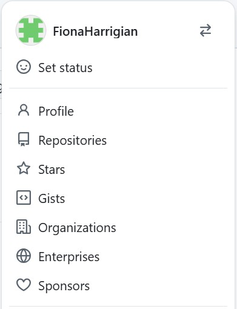
```

2. Click the green "New" button in the upper right hand corner of the Repositories tab.

```{r new_repo, echo=FALSE, fig.align='center', out.width = '75%'}
#Creating a remote repository
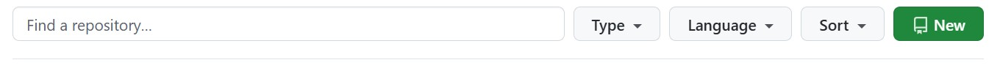
```

3. Fill out the new Repository, your username should be in the owner section. Give the repository a name that is easy for you to remember, cannot match the name of another repository in your account. GitHub will recommend fun and interesting names, which would be unique but may be hard to remember and associate with your work, so be careful what you choose. 

For the Configuration options:

1. Create a public repository.
2. Turn on Add README so that you'll have a readme file in your repository.
3. Turn on Add .gitignore file and choose R as file template. 
4. Click Create Repository.

```{r creatingrepo, echo=FALSE, fig.align= 'center', out.width = '50%'}
#Creating a remote repository
knitr::include_graphics("Pictures/creatingrepo.png")
```


### Creating a local repository in RStudio

In RStudio, just like creating a new project at the beginning of this class (or anytime you want to start a new project), you can make a new project that can be linked to a remote repository in GitHub. 

1. Go back to your GitHub, find the repository you just made and go to the green Code button in the upper right hand corner. Click this and a tab will appear that says Clone. Under this tab, there is a HTTPS section. Make sure you are in this section, then press the icon of one square on top of another inside of the red circle below in Figure \@ref(fig:redcircle).

```{r redcircle, echo=FALSE, fig.align= 'center', fig.cap="Cloning Repository from GitHub into RStudio", out.width = '75%'}
#Cloning your repository

knitr::include_graphics("Pictures/redcircle.png")
```

2. Create a new project on RStudio with Git version control by first choosing "Version Control" in the new project wizard.

```{r createRproject, echo=FALSE, fig.align= 'center', out.width = '50%'}
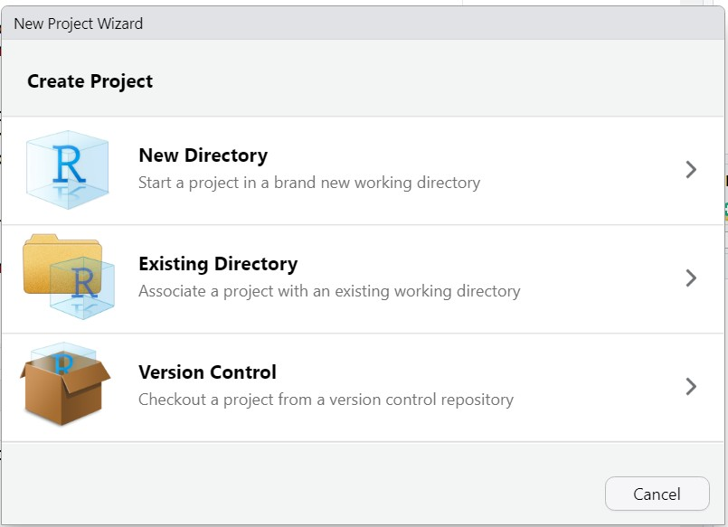
```

3. Next, select the Git button to clone a project from a Git repository.

```{r GitRproject, echo=FALSE, fig.align= 'center', out.width = '50%'}
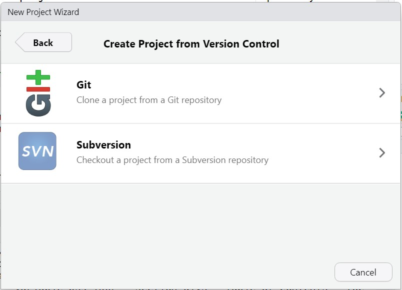
```


4. Paste this url that you just copied into the box that says Repository URL inside the Clone Git Repository box. For the Project directory name, use the same name as your GitHub repository. Create the new RStudio Git version control inside a subdirectory, using your Desktop, Documents folder, or anywhere you normally create new RStudio directories.

```{r gitversion, echo=FALSE, fig.align= 'center', out.width = '50%'}
#Cloning your repository
knitr::include_graphics("Pictures/gitversion.png")
```

### Turn on notifications for push changes

If you are the owner of the repository, when you and your collaborators make changes, you can see the changes if you have push notifications turned on. This is good for tracking and knowing what your collaborators are working on. 
To turn on push notifications: 

1. Click on Settings on the upper right while in the repository you just created (or any you need notifications for). 

```{r settings, echo=FALSE, fig.align = 'center', out.width = '75%'}
#show how to do push notifications
knitr::include_graphics("Pictures/settings.jpg")
```


2. Scroll down to the bottom of the list of settings and in the lower left corner, click on Email notifications.
You should see the Email notifications page. 


```{r emailnot, echo=FALSE, fig.align= 'center', out.width = '50%'}
knitr::include_graphics("Pictures/email_not.jpg")
```


3. Make sure to add the email address you would like to receive notifications on, check the box next to Active if not already checked, then press Update settings. 


```{r pushnot, echo=FALSE, fig.align= 'center', out.width = '50%'}
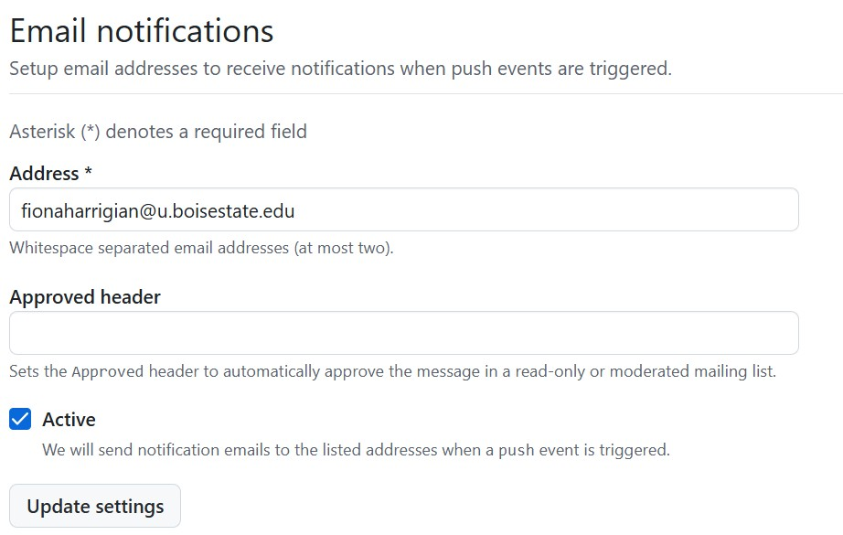
```


Unfortunately only the admin or owner of the repository can get notifications when changes are made. So far we have not found a way to make collaborators receive these notifications. We tried using the “Watch” button in the upper right for the collaborator to receive this messages, but that did not seem to work. This remains to be explored as it can be a useful tool for remote communication. 

### Activity for Day 1 of the Tutorial

By now, you should have created a repository of your own and linked it with a matching project in RStudio. The next piece of working in github is to practice working with a collaborator.

In pairs, you will:

1. Choose one of the pair to be the admin and one to be the collaborator. 

2. The admin will go to the settings of their repository, then click on Collaborators in the upper left area of the settings. You’ll be prompted to login, once you do, you’ll get to the collaborators screen. 

```{r activity1, echo=FALSE, fig.align= 'center', out.width = '50%'}
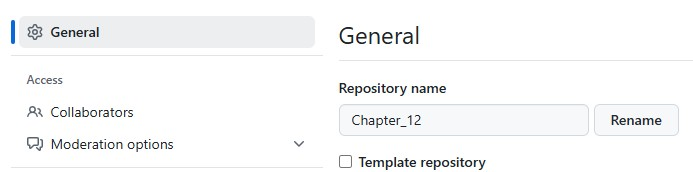
```

```{r activity2, echo=FALSE, fig.align= 'center', out.width = '25%'}
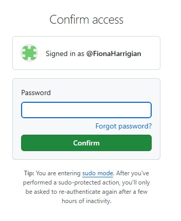
```

```{r activity3, echo=FALSE, fig.align= 'center', out.width= '50%'}
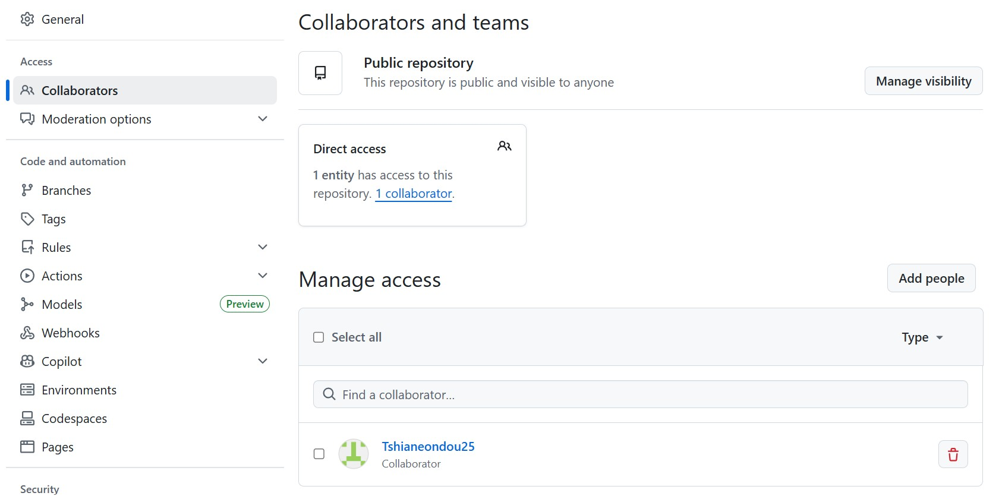
```


3. Add your partner by clicking the add people button and searching for your partner’s GitHub account name (check with them, sometimes it may be different from their name, include numbers, etc.)

```{r activity4, echo=FALSE, fig.align= 'center', out.width = '50%'}
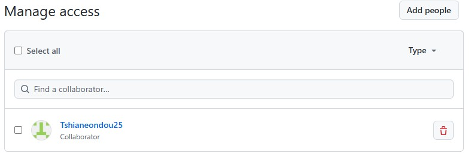
```

4. Click Add to repository, your partner should get a code in an email to access your repository.

```{r introrepo, echo=FALSE, fig.align= 'center', out.width = '50%'}
#when you invite your collaborator, this is how the page will look like 
knitr::include_graphics("Pictures/introrepo.png")
```

5. Once the collaborator partner finds the admin’s repository, click on the green code button in the upper right hand corner.

```{r activity5, echo=FALSE, out.width = '100%'}
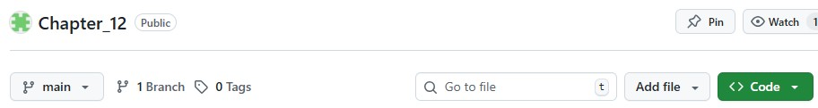
```

6. Copy the HTTPS URL with the box button to the right of the url.
Follow the directions to clone your repository in RStudio as presented in [Creating a local repository in RStudio](#creating-a-local-repository-in-rstudio).

```{r activity6, echo=FALSE, fig.align = 'center', out.width = '50%'}
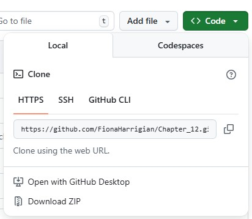
```

7. Once each of you have the repository open in RStudio, one will go first, writing a sentence in the README.md, saving the your local file, committing the change Figure \@ref(fig:redgreen), pushing the change to the remote GitHub repository file, then the other partner pulls that change with the down pull arrow and adds their own sentence. 

8. Do a repeat of this exercise until you have 3 sentences each (or 1 each for time).
* Have conversation with each other (Fiona and Tshia will push and pull and demonstrate on the projector).

### Committing your changes cautiously

* Do not commit at the same time as your collaborator, Git does not like it. It will show an error (Figure \@ref(fig:redgreen)).
* Make sure the box for the doc/file you are working on is checked before (blue tick) before you push. This stages the file and enables changes to be committed.
* You will need to write something in the commit box for GitHub to accept the changes and it is helpful to summarize the changes you have made for your future reference and your collaborators. Remember, some of the power of GitHub is that changes can be tracked, but this feature is only helpful when you can easily pick out the version you are looking for from a long list of versions.
* To avoid accidental merging and overwriting your changes or the changes of your collaborators,  communicate with your them when committing, pushing, and pulling changes. After creating this tutorial, we also found it helpful to have a backup version (not associated with GitHub) saved as well.


```{r redgreen, echo=FALSE, fig.align= 'center', fig.cap="Interface when pushing and committing changes", out.width = '75%'}
#what does red and green colors mean when you are communicating with your collaborator
knitr::include_graphics("Pictures/red_green.png")
```


# Day 2

## Learning Objectives

* [Activity for Day 2 of the Tutorial](#activity-for-day-2-of-the-tutorial)
* [Checking out public repositories](#checking-out-public-repositories)
* [Import data into R from a GitHub repository](#import-data-into-r-from-a-github-repository)
* [Downloading data, uploading data, importing into RStudio project](#downloading-data-uploading-data-importing-into-rstudio-project)

### Activity for Day 2 of the Tutorial

In **Day 1**, we learned [Key Terms](#key-terms) for work in **Git** and **GitHub**, made a new repository in GitHub and cloned it into a new RStudio Git version control project, and worked with partners to practice making changes, committing them, pushing changes to the remote GitHub repository, and pulling changes from the **remote GitHub repository** to your **local RStudio project** files.

On **Day 2**, we will look at **GitHub repositories** that are alive and nice examples of how your GitHub repository might look in the future! We will practice importing data from one of these into RStudio, and uploading data into your own GitHub repository.

### Checking out public repositories

As you read more papers, interact with collaborators, and become a scientist doing extremely reproducible science, you will likely need to bring data from a public GitHub repository into your own computer and into R. 

* One example of a public repository is Sven’s repository for this class [Reproducible 603](https://github.com/svenbuerki/EEB603_Reproducible_Science). Following the link, you can see his repository, with all the folders and files inside displayed in a list. If you scroll to the bottom, you can see the README with information about this repository/class.

* Another example of a public repository is one that was made as part of a paper submission. Fiona read a cool microbial ecology paper that tracked the ecological and evolutionary responses of Curtobacterium over an elevation gradient in Southern California [@Chase2021]. In the paper, there is a section that says Data Availability. Following the [link](https://github.com/alex-b-chase/curtoEvol) to their github, we can see a similar set of folders and files, as well as a README.

```{r Chasedata, echo=FALSE, fig.align= 'center', out.width = '50%'}
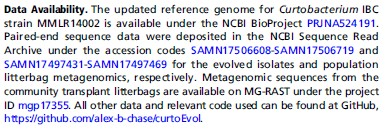
```

### Import data into R from a GitHub repository

* For either repository, find a data file. Usually, you will have the specific data in mind and may have background for the name you are looking for. However, sometimes repositories can be unclear. Use what we have learned in class to identify data, whether a .csv file, a .txt file, or a .xlsx file. 

### Downloading data, uploading data, importing into RStudio project

1. Download the data file by clicking on the Download raw file button. It will now be on your computer. 

2. Practice uploading data to your own GitHub repository by returning to your repository, clicking the add file button next to the green code button, then Upload files in the dropdown. 

3. You can drag files into the box or choose your files. Make sure to commit your changes in the section underneath the box. 

4. To import data into RStudio, go to your repository in GitHub. 

5. Find the data file we just uploaded and go to the file by clicking on it in the list of files in your repository. 

6. Click on the Raw button in the upper left. 

7. It should bring you to a page with just the file contents and the url at the top is what you need to copy. 

8. Moving back to RStudio, in a new R script, run these lines of code:

```{r importdata, echo=TRUE}
# Paste URL into url object
#url <-"PASTE HERE"
# Download data
#YOUR_data <- rio::import(url, format = "csv")
```

You should now see your data file in the environment, ready to be used!


# Relevant resources

As a final send-off to all of you (and any future users of this tutorial), here is a list of resources we used to build this tutorial. 

For the latest version of Gandrud's textbook, visit this link which will allow you to search Boise State University's library and download an ebook: [3rd edition reproducuble Research with R and Rstudio](https://boisestate.on.worldcat.org/search?queryString=gandrud%20reproducible&bookReviews=off&idDetect=true&clusterResults=true&groupVariantRecords=false)

[Github for dummies video](https://www.youtube.com/watch?v=mJ-qvsxPHpY&t=859s)

[Github control version video](https://www.youtube.com/watch?v=HVsySz-h9r4&t=9s)


# References

<div id="refs"></div>

# (APPENDIX) Appendices {-}

# Appendix 1

Citations of all R packages used to generate this report.
```{r generateBibliography, results="asis", echo=FALSE, warning=FALSE, message=FALSE}

### Load R package
library("knitcitations")
### Process and print citations in packages.bib Clear all
### bibliography that could be in the cash
cleanbib()
# Set pandoc as the default output option for bib
options(citation_format = "pandoc")
# Read and print bib from file
read.bibtex(file = "packages.bib")
```

# Appendix 2

Version information about R, the operating system (OS) and attached or R loaded packages. This appendix was generated using `sessionInfo()`.
```{r sessionInfo, eval=TRUE, echo=FALSE, warning=FALSE, message=FALSE}

# Load and provide all packages and versions
sessionInfo()
```


